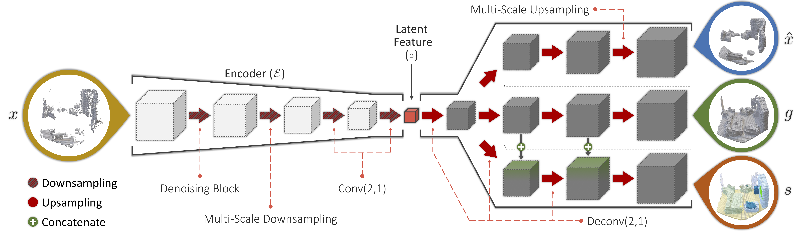
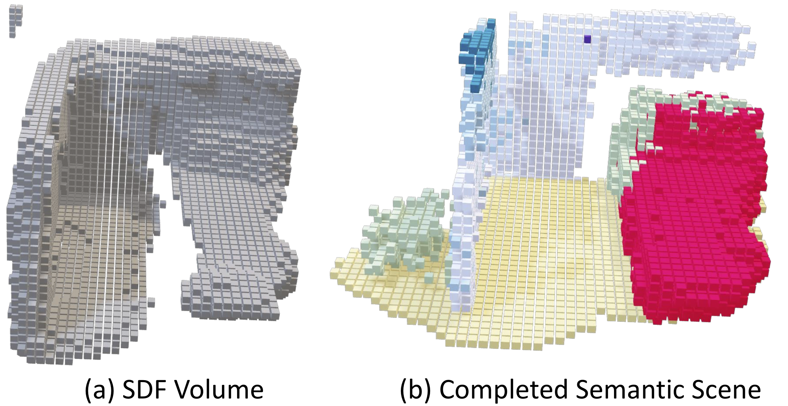

# ForkNet: Multi-branch Volumetric Semantic Completion from a Single Depth Image

The implementation of our paper accepted in **ICCV** *2019* (*International Conference on Computer Vision*, IEEE)
**[Yida Wang](https://wangyida.github.io/#about), David Tan, [Nassir Navab](http://campar.in.tum.de/Main/NassirNavab) and [Federico Tombari](http://campar.in.tum.de/Main/FedericoTombari)**.
If you find this work useful in yourr research, please cite:

```bash
@inproceedings{wang2019forknet,
  title={ForkNet: Multi-branch Volumetric Semantic Completion from a Single Depth Image},
  author={Wang, Yida and Tan, David Joseph and Navab, Nassir and Tombari, Federico},
  booktitle={Proceedings of the IEEE International Conference on Computer Vision},
  pages={8608--8617},
  year={2019}
}
```

## ForkNet

 

### Architecture


The overall architecture is combined with 1 encoder with input of a TSDF volume and 3 decoders.


### Generated synthetic samples
Given 1 latent sample, we can use 2 decoders to generate a pair of TSDF volume and semantic scene separately.


### More examples


## Data preprocessing
### Depth image to TSDF volumes
Firstly you need to go to depth-tsdf folder to compile the our depth converter. Then *camake* and *make* are suggested tools to compile our codes.

```shell
cmake . # configure
make # compiles demo executable
```
After the file named with **back-project** is compiled, depth images of NYU or SUNCG datasets could be converted into TSDF volumes parallelly.

```shell
CUDA_VISIBLE_DEVICES=0 python2 data/depth_backproject.py -s /media/wangyida/SSD2T/database/SUNCG_Yida/train/depth_real_png -tv /media/wangyida/HDD/database/SUNCG_Yida/train/depth_tsdf_camera_npy -tp /media/wangyida/HDD/database/SUNCG_Yida/train/depth_tsdf_pcd
```

### Semantic volumes used for training
We further convert the binary files from SUNCG and NYU datasets into numpy arrays in dimension of [80, 48, 80] with 12 semantic channels. Those voxel data are used as training ground truth. Notice that our data is presented in numpy array format which is converted from the original [binary data](https://sscnet.cs.princeton.edu/)

```shell
python2 data/depthbin2npy.py -s /media/wangyida/HDD/database/SUNCGtrain_1001_2000  -tv /media/wangyida/HDD/database/SUNCG_Yida/train/voxel_semantic_npy &
python2 data/depthbin2npy.py -s /media/wangyida/HDD/database/SUNCGtrain_501_1000  -tv /media/wangyida/HDD/database/SUNCG_Yida/train/voxel_semantic_npy &
python2 data/depthbin2npy.py -s /media/wangyida/HDD/database/SUNCGtrain_1_1000  -tv /media/wangyida/HDD/database/SUNCG_Yida/train/voxel_semantic_npy &
python2 data/depthbin2npy.py -s /media/wangyida/HDD/database/SUNCGtrain_1001_3000  -tv /media/wangyida/HDD/database/SUNCG_Yida/train/voxel_semantic_npy &
python2 data/depthbin2npy.py -s /media/wangyida/HDD/database/SUNCGtrain_3001_5000  -tv /media/wangyida/HDD/database/SUNCG_Yida/train/voxel_semantic_npy &
python2 data/depthbin2npy.py -s /media/wangyida/HDD/database/SUNCGtrain_1_500  -tv /media/wangyida/HDD/database/SUNCG_Yida/train/voxel_semantic_npy &
python2 data/depthbin2npy.py -s /media/wangyida/HDD/database/SUNCGtrain_5001_7000  -tv /media/wangyida/HDD/database/SUNCG_Yida/train/voxel_semantic_npy &
python2 data/depthbin2npy.py -s /media/wangyida/HDD/database/depthbin_NYU_SUNCG/SUNCGtest_49700_49884 -tv /media/wangyida/HDD/database/SUNCG_Yida/test/voxel_semantic_npy &
python2 data/depthbin2npy.py -s /media/wangyida/HDD/database/depthbin_NYU_SUNCG/NYUtrain -tv /media/wangyida/HDD/database/NYU_Yida/train/voxel_semantic_npy &
python2 data/depthbin2npy.py -s /media/wangyida/HDD/database/depthbin_NYU_SUNCG/NYUtest -tv /media/wangyida/HDD/database/NYU_Yida/test/voxel_semantic_npy &
wait
```

## Train and Test
### Training
```shell
CUDA_VISIBLE_DEVICES=0 python3 main.py --mode train --discriminative True
```
### Testing
We provide a compact version of ForkNet which is only 25 MB in the pretrained_model folder
If the model is not discriminative 
```shell
CUDA_VISIBLE_DEVICES=1 python main.py --mode evaluate_recons --conf_epoch 0
```
Otherwise
```shell
CUDA_VISIBLE_DEVICES=1 python main.py --mode evaluate_recons --conf_epoch 60 --discriminative True
```
where '--conf_epoch' indicates the index of the pretrained model
